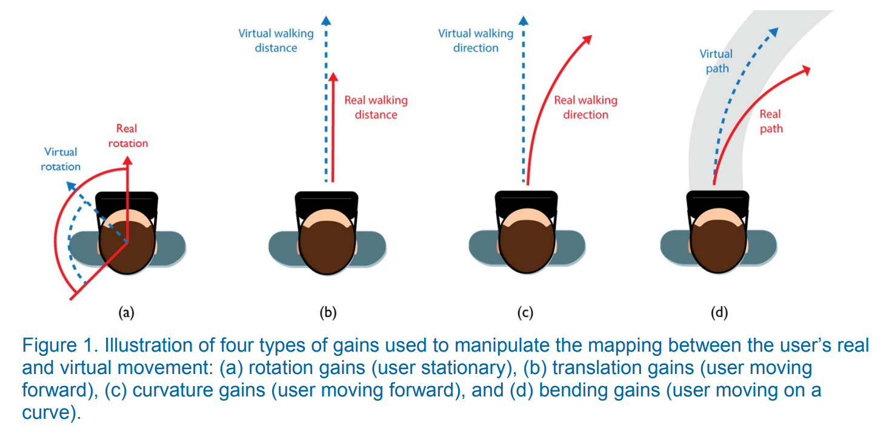

# [VR] RDW technology and EEG measurement made with Unity

Unity 가상환경에서 Redirected walking을 적용하였을때, 뇌파변화와 gaze의 변화를 찾기위 한 실험 환경

## 🛠기술 스택

C#, Tobii, SteamVR

## 🧩구성환경

- LOOXID link 기구로 전두엽, 전전두엽 6개 부위 뇌파 측정(FP1,Fp,AF3,AF4,AF7,AF8)
- VIVE PRO 에 있는 tobii eye tracker를 통해 eye tracking 사용
- translation, rotation, culvature gain RDW기술 적용

